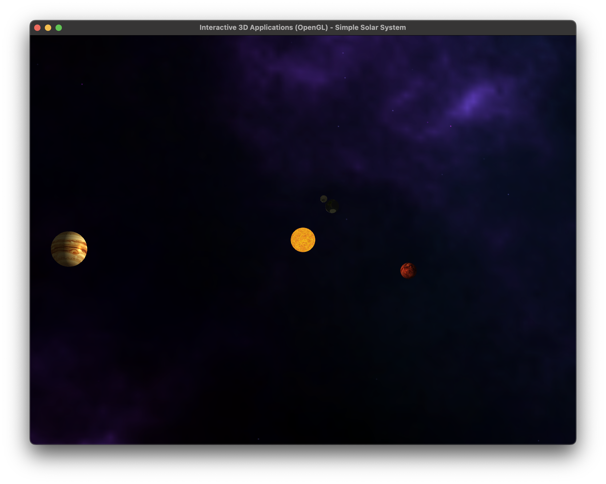
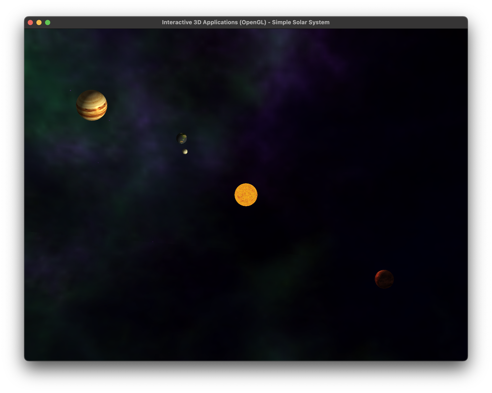
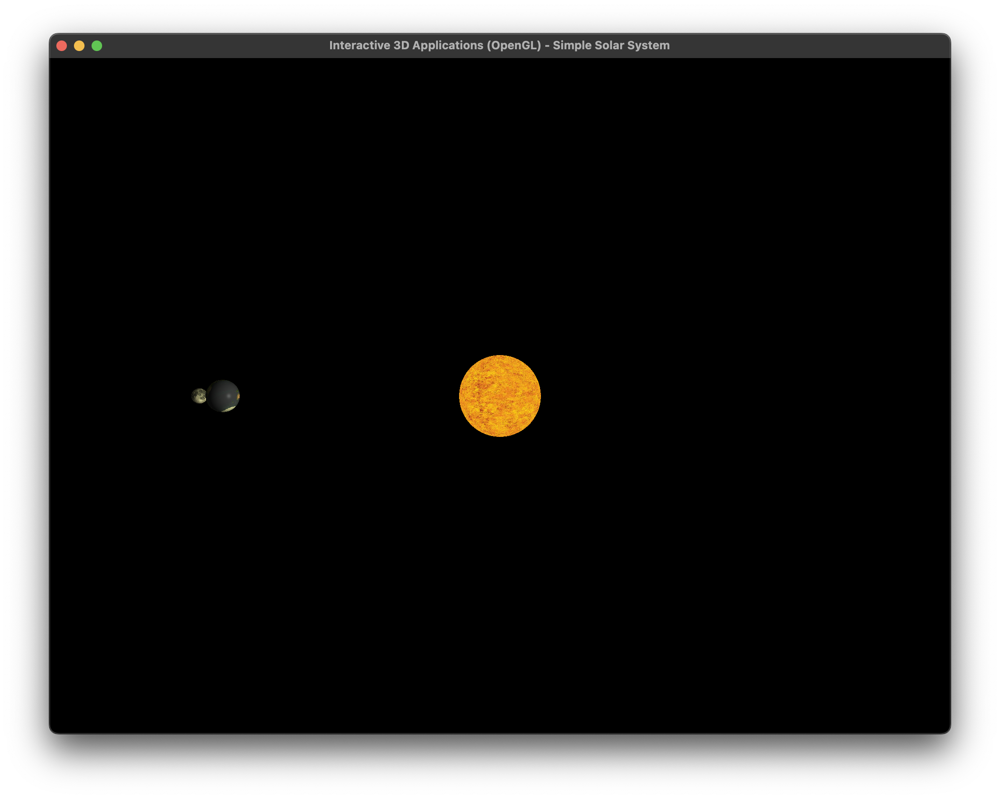

# IGR200 - Interactive 3D Application Development
## Solar System Project Report - Emile LE GALLIC

This project focuses on creating an interactive 3D solar system using C++ and OpenGL. Below is a detailed overview of the development process and key features implemented.

### 1. The First Spheres

I began by using the Mesh class to generate a sphere mesh with a specific resolution. The goal of `genSphere` was to divide the sphere into sectors, with each point expressed through its parametric equation:

`x = r * cos(phi) * cos(theta)`  
`y = r * cos(phi) * sin(theta)`  
`z = r * sin(phi)`

The points were gradually placed by incrementing both phi and theta by `π * i / resolution` and `2 * π * j / resolution`, respectively. Triangulating adjacent vertices required complex computations between two horizontal divisions.

For the normals, it was straightforward since, for a sphere, it is the line from the center to the vertex. Triangulation involved computing triangles between two horizontal divisions.

At this point, I successfully rendered a correct sphere and added color using a color vector in the fragment shader.

### 2. Rotations and Orbits

Transformation was applied to celestial objects using `glm::translate` and `glm::rotate`. Planets were moved away from the sun, and rotations around the sun were implemented. The position of the planet was computed based on orbit radius and period.

### 3. Textures

Texture implementation presented challenges, especially in computing vertex texture coordinates. The 2D texture image was divided into square sectors of the length of the resolution. Textures for Earth, the sun, and the moon were added, fixing lighting issues caused by neglecting transformations in vertex shaders.

### 4. Further Features

Additional features included zoom control with the mouse wheel, camera movement with arrow keys, and the incorporation of a skybox for a captivating space background.

### 5. Notes and Usage

The project utilizes three main classes:

- **CelestialObject:** Represents a Planet or a Star with properties like orbit period, radius, rotation period, parent star, and texture.
- **Camera:** Controls camera movement and handles keyboard/mouse inputs.
- **Skybox:** Generates the space background.

The `main.cpp` file orchestrates the program execution.

### Commands:

- **Mouse Scroll:** Adjust zoom.
- **Arrow Keys:** Move the camera.

### Images

*With skybox*

*With skybox*

*In the dark*
